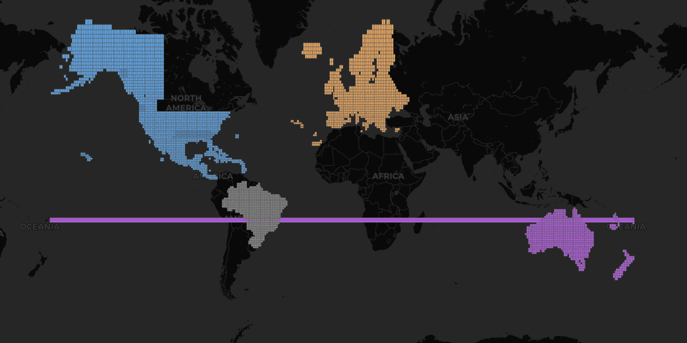

# XEarthLayer Regional Scenery Packages

This repository hosts regional scenery packages for [XEarthLayer](https://github.com/samsoir/xearthlayer).

## Coverage Map



*NA tiles in blue, EU tiles in orange, SA tiles in green, OC tiles in purple. [View interactive map](coverage.geojson) for exact tile boundaries.*

## Available Regions

| Region | Code | Version | Tiles | Ortho Size | Overlay Size |
|--------|------|---------|-------|------------|--------------|
| Europe | EU | 0.1.1 | 1,995 | 29.8 GB | 2.1 GB |
| North America | NA | 0.2.3 | 2,860 | 72.9 GB | 2.5 GB |
| Oceania | OC | 0.2.0 | 1,276 | 8.7 GB | 239 MB |
| South America | SA | 0.2.0 | 1,734 | 26.5 GB | 1.1 GB |

## Installation

```bash
# Configure the package library URL
xearthlayer config set packages.library_url https://raw.githubusercontent.com/samsoir/xearthlayer-regional-scenery/main/xearthlayer_package_library.txt

# Install a region
xearthlayer packages install na --type ortho
xearthlayer packages install na --type overlay
```

## Package Downloads

Packages are distributed as GitHub Release assets. The package manager handles downloading automatically.

For manual downloads, see the [Releases](https://github.com/samsoir/xearthlayer-regional-scenery/releases) page.

## Coverage Details

### Europe (EU) v0.1.1

Expanded coverage including:
- United Kingdom & Ireland
- France, Germany, Benelux
- Spain, Portugal
- Italy, Switzerland, Austria, Alps
- Scandinavia (Norway, Sweden, Finland, Denmark)
- Iceland
- Eastern Europe (Poland, Czech Republic, Hungary, Balkans)
- Mediterranean (Greece, Turkey, Cyprus)
- Baltic States

### North America (NA) v0.2.3

Expanded coverage including:
- **Hawaii** - Main islands
- **Alaska** - Major areas
- **Canada** - Partial coverage
- **Contiguous 48 States** - Partial coverage
- **Caribbean** - Islands and coastal areas
- **Mexico** - Coverage areas

Geographic extent: +07° to +71° latitude, -078° to -163° longitude

### Oceania (OC) v0.2.0

Expanded coverage including:
- **Australia** - Complete mainland and Tasmania
- **New Zealand** - North and South Islands
- **Papua New Guinea** - Comprehensive coverage
- **Fiji** - Main islands
- **French Polynesia** - Tahiti and surrounding islands
- **Vanuatu** - Island chain coverage
- **Solomon Islands** - Major islands

Geographic extent: -48° to +02° latitude, +112° to -149° longitude

### South America (SA) v0.2.0

Complete continental coverage including:
- **Brazil** - Comprehensive coverage
- **Argentina** - Full coverage including Patagonia
- **Chile** - Full coverage from Atacama to Tierra del Fuego
- **Peru, Bolivia, Ecuador, Colombia, Venezuela** - Complete coverage
- **Paraguay, Uruguay, Guyana, Suriname, French Guiana** - Complete coverage
- **Falkland Islands** - Included
- **Offshore Islands** - Galápagos and other coastal islands

Geographic extent: -56° to +00° latitude (Equator to Cape Horn)

## Website Sync

When the library index is updated, changes are automatically synced to [xearthlayer.app](https://xearthlayer.app):

1. Push to `main` with changes to `xearthlayer_package_library.txt`
2. `notify-website.yml` triggers `repository_dispatch` to the website repo
3. Website fetches updated library and regenerates package documentation
4. Site deploys automatically

### Required Setup

The `WEBSITE_DISPATCH_TOKEN` secret must be configured with a fine-grained PAT that has:
- **Repository access:** `samsoir/xearthlayer-website`
- **Permissions:** Contents (read/write)
- **Expiration:** 90 days (maximum for fine-grained tokens)

Set a calendar reminder to refresh the token before expiration. The daily cron fallback ensures syncs still occur if the token expires.

## License

Scenery data generated from publicly available satellite imagery.
