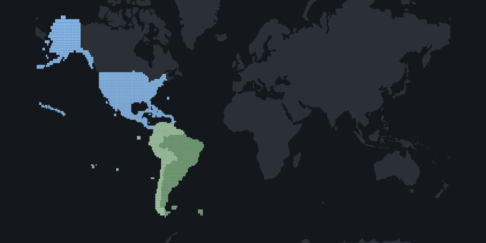

# XEarthLayer Regional Scenery Packages

This repository hosts regional scenery packages for [XEarthLayer](https://github.com/samsoir/xearthlayer).

## Coverage Map



*NA-USA-MX-CENTRAL tiles in light blue, NA-CANADA-WEST in mid blue, NA-CANADA-EAST in slate blue, NA-GREENLAND in ice blue, SA-WEST in light green, SA-EAST in dark green. [View interactive map](coverage.geojson) for exact tile boundaries.*

## Available Regions

| Region | Code | Version | Tiles | Ortho Size | Overlay Size |
|--------|------|---------|-------|------------|--------------|
| North America: Eastern Canada | NA-CANADA-EAST | 0.1.0 | 1,054 | 47.7 GB | 301.5 MB |
| North America: Western Canada | NA-CANADA-WEST | 0.1.0 | 1,117 | 36.7 GB | 248.1 MB |
| North America: Greenland | NA-GREENLAND | 0.1.0 | 802 | 2.5 GB | 2.6 MB |
| North America: United States, Mexico and Central America | NA-USA-MX-CENTRAL | 0.1.1 | 1,817 | 26.3 GB | 1.9 GB |
| South America: East | SA-EAST | 0.1.0 | 1,188 | 11.1 GB | 697.8 MB |
| South America: West | SA-WEST | 0.1.0 | 691 | 10.8 GB | 342.0 MB |

The world scenery is being rebuilt into smaller regions, all on the staging channel for now. North America and South America are complete; more regions will be added as they are rebuilt, with Europe next.

## Installation

```bash
# The package library URL. This is the default, so it is only needed if you
# have pointed XEarthLayer somewhere else (for example at the staging channel)
xearthlayer config set packages.library_url https://xearthlayer.app/packages/xearthlayer_package_library.txt

# Install a region
xearthlayer packages install na-usa-mx-central --type ortho
xearthlayer packages install na-usa-mx-central --type overlay
```

### Staging Channel

Regions under test are published on the `staging` branch. To install them, point at the staging library index:

```bash
xearthlayer packages install sa-west \
  --library-url https://raw.githubusercontent.com/samsoir/xearthlayer-regional-scenery/staging/xearthlayer_package_library.txt
```

## Package Downloads

Packages are distributed as GitHub Release assets. The package manager handles downloading automatically.

For manual downloads, see the [Releases](https://github.com/samsoir/xearthlayer-regional-scenery/releases) page.

## Coverage Details

### North America: United States, Mexico and Central America (NA-USA-MX-CENTRAL) v0.1.1 (staging)

Continental United States, Alaska including the Aleutian Islands, Hawaii, Mexico, Central America, the Caribbean and Bermuda. Together with NA-CANADA-WEST, NA-CANADA-EAST and NA-GREENLAND it covers North America.

### North America: Western Canada (NA-CANADA-WEST) v0.1.0 (staging)

British Columbia, Alberta, Saskatchewan, Manitoba, Yukon, the Northwest Territories and western Nunavut, west of 95°W.

### North America: Eastern Canada (NA-CANADA-EAST) v0.1.0 (staging)

Ontario, Quebec, New Brunswick, Nova Scotia, Prince Edward Island, Newfoundland and Labrador, and eastern Nunavut including Baffin and Ellesmere Islands, east of 95°W. The Canadian Shield's many lakes each need a water mask, so this region is larger per tile than its neighbours.

### North America: Greenland (NA-GREENLAND) v0.1.0 (staging)

Greenland, which sits on the North American tectonic plate. Tiles in Nares Strait are included in both this region and NA-CANADA-EAST, so either region is complete on its own.

### South America: West (SA-WEST) v0.1.0 (staging)

Chile, Peru, Bolivia, Ecuador, Colombia, Venezuela, Guyana, Suriname and French Guiana, with Easter Island, Pitcairn Island, the Galápagos Islands, Trinidad, Aruba, Curaçao and Bonaire. Tiles along the border with SA-EAST are included in both regions, so either region is complete on its own.

### South America: East (SA-EAST) v0.1.0 (staging)

Brazil, Argentina, Paraguay and Uruguay, with the Falkland Islands and South Georgia. Tiles along the border with SA-WEST are included in both regions, so either region is complete on its own.

## Website Sync

When the library index is updated, changes are automatically synced to [xearthlayer.app](https://xearthlayer.app):

1. Push to `main` with changes to `xearthlayer_package_library.txt`
2. `notify-website.yml` triggers `repository_dispatch` to the website repo
3. Website fetches updated library and regenerates package documentation
4. Site deploys automatically

### Required Setup

The `WEBSITE_DISPATCH_TOKEN` secret must be configured with a fine-grained PAT that has:
- **Repository access:** `samsoir/xearthlayer-website`
- **Permissions:** Contents (read/write)
- **Expiration:** 90 days (maximum for fine-grained tokens)

Set a calendar reminder to refresh the token before expiration. The daily cron fallback ensures syncs still occur if the token expires.

## License

Scenery data generated from publicly available satellite imagery.
